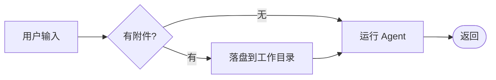
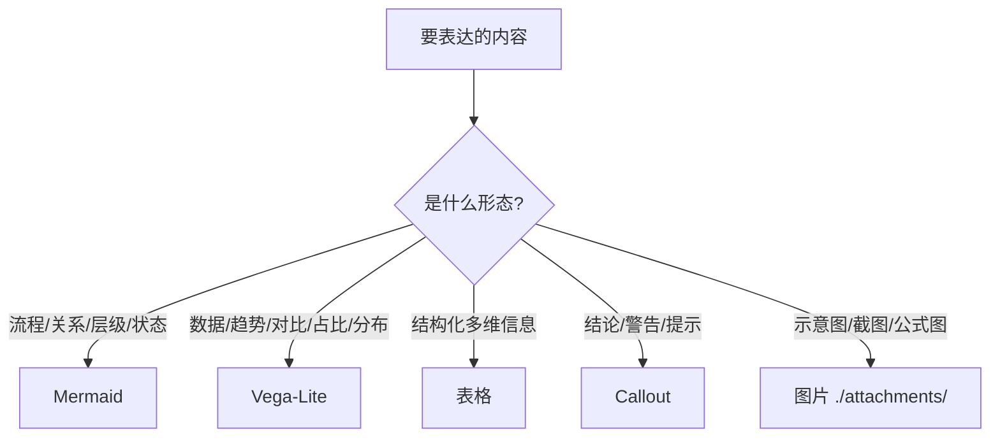

# wiki — Markdown 富文本技法速查

写 wiki 页面时**尽量用这些技法把内容做得直观、可视化**，而不是只堆纯文本。来源：仓库 `documents/markdown-complete-demo`。渲染器使用 GitHub Flavored Markdown，并额外支持 **Mermaid 图** 与 **Vega-Lite 图表**。

> 原则：**能图就别只用文字**。流程/关系/层级 → Mermaid；数据/趋势/对比/占比 → Vega-Lite；结构化信息 → 表格；提示/警告/结论 → callout。

---

## 1. 表格

用 `|` 分列，第二行用 `---` 分隔表头；冒号控制对齐：

```markdown
| 左对齐 | 居中 | 右对齐 |
| :----- | :--: | -----: |
| a | b | $1600 |
```

单元格内可含行内 Markdown（链接、**粗体**、*斜体*、~~删除线~~）。结构化、可对比的信息优先用表格。

## 2. 代码块（围栏 + 语言标识）

用 ```` ``` ```` 围栏，并标注语言以获得语法高亮：

````markdown
```js
function test() { console.log("hi"); }
```
````

## 3. Mermaid 图（流程 / 关系 / 时序 / 状态）

围栏标 `mermaid`。最常用 `flowchart`：

````markdown

````

适用：决策路由、架构关系、流程步骤、状态机、人物/概念关系图。本 vault 的关系地图、模型选择器、因果图都用它。
常用类型：`flowchart`（流程/关系）、`sequenceDiagram`（时序）、`stateDiagram-v2`（状态）、`mindmap`（脑图）、`gantt`（排期）。
小贴士：节点文本里可放 `[[wikilink]]` 串联到其它页面（见本 vault 思维模型选择器）。

## 4. Vega-Lite 图表（数据可视化）

围栏标 `vega-lite`，**body 是一份自包含的 Vega-Lite JSON**——数据内联在 `data.values`，无需联网。挑常用几种（完整画廊见 demo 与各 `references/books` 笔记）：

**折线（时间序列）** — `"mark": {"type":"line","point":true}`，x 用 `"type":"temporal"`。
**柱状（分类对比）** — `"mark":"bar"`，x 用 `"type":"nominal"`。
**饼/环（占比）** — `"mark":{"type":"arc","innerRadius":60}` + `"theta"`。
**多系列折线** — 加 `"color":{"field":"...","type":"nominal"}`。
**双轴（柱+线）** — `"layer":[...]` + `"resolve":{"scale":{"y":"independent"}}`。
**热力图（季节性）** — `"mark":"rect"` + 发散色阶 `"scale":{"scheme":"redyellowgreen","domainMid":0}`。

最小可用示例（柱状）：

````markdown
```vega-lite
{
  "$schema": "https://vega.github.io/schema/vega-lite/v5.json",
  "title": "季度营收 (百万美元)",
  "data": {"values": [
    {"q":"Q1","rev":312},{"q":"Q2","rev":348},{"q":"Q3","rev":401},{"q":"Q4","rev":455}
  ]},
  "mark": "bar",
  "encoding": {
    "x": {"field":"q","type":"nominal","title":"季度","axis":{"labelAngle":0}},
    "y": {"field":"rev","type":"quantitative","title":"营收 ($M)"},
    "tooltip": [{"field":"q"},{"field":"rev","format":"$,.0f"}]
  }
}
```
````

要点：每个 spec **自包含**（数据内联）；加 `title`、`tooltip` 提升可读；`"scale":{"zero":false}` 让非零基线的趋势更清楚。**写 JSON 后务必确认能被 `json.loads` 解析**（逗号、引号、括号闭合）。

## 5. 图片与媒体

标准语法 ``，按扩展名自动选查看器：

| 类型 | 写法 |
|---|---|
| 图片 | `` |
| 视频 | `` |
| 音频 | `` |
| PDF | `` |
| 其它文件 | ``（下载链接） |

路径可相对当前文档，或用完整 `http(s)://` URL。本 vault 约定附件放在页面同级或邻近的 `attachments/`。

## 6. Callout（提示框）与脚注

Obsidian/渲染器支持 callout，用来突出**结论、警告、提示、问题**（本 vault 模板大量使用）：

```markdown
> [!abstract] 摘要
> [!tip] 提示    > [!success] 成功/结论
> [!warning] 警告   > [!question] 待解决
> [!bug] 问题    > [!danger] 风险
```

脚注：正文 `这里有脚注[^1]`，文末 `[^1]: 脚注内容`。

---

## 选择器：什么内容用什么



> 写每一页前先想：这里有没有**关系**可以画成 Mermaid、有没有**数字**可以画成 Vega-Lite。优先可视化。
